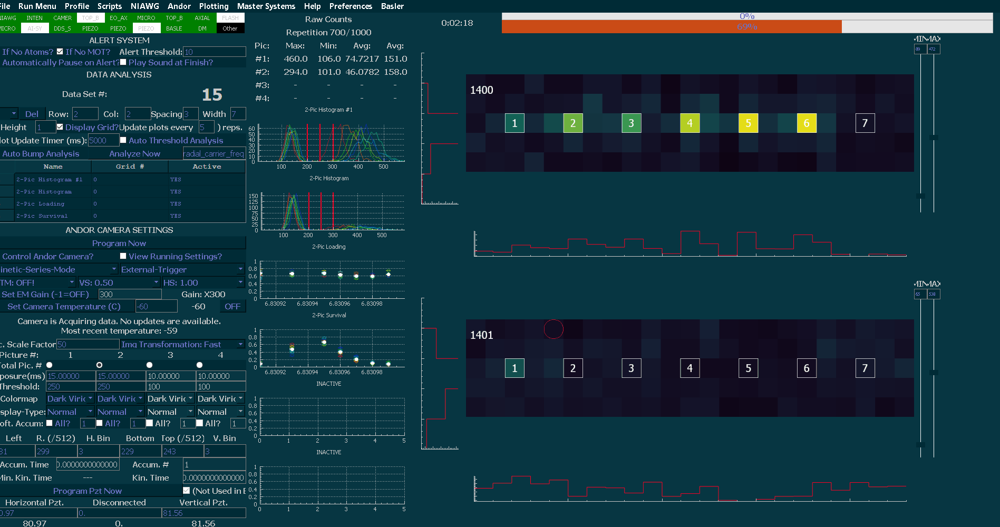
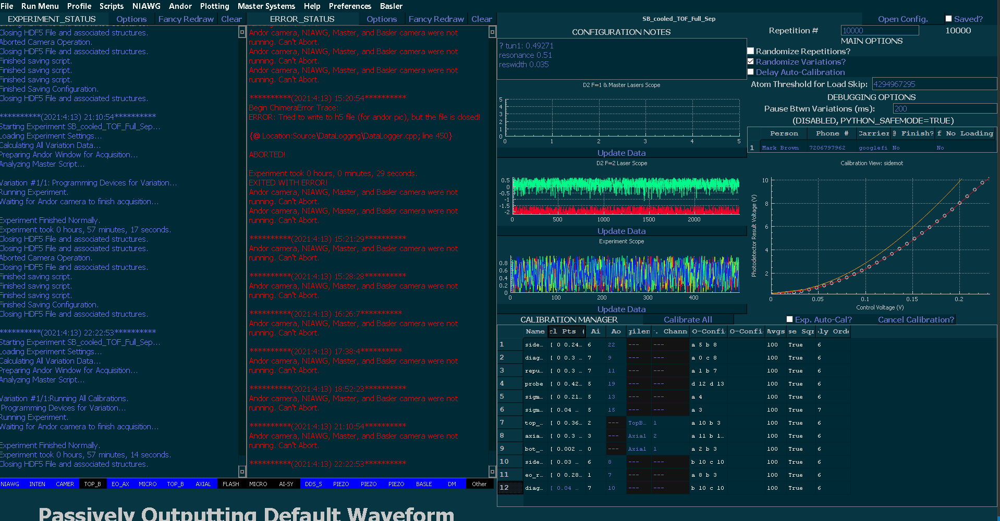

#    **Chimera-Control Project**

## Summary

"Chimera" is the control program which I developed primarily for controlling the experimental apparatus in Cindy Regal's Atomic physics lab in JILA room B232. It has since become a more general project which is used by several other labs in JILA as well. It originated as three separate projects which were eventually merged (hence the name). The core code has also gone through many evolutions, starting as a raw Win32 project (when I barely knew what I was doing), then evolved into using the MFC libraries, and is since 2020 based on Qt.

The control program has four primary objectives at this point:
- Program of all devices in the experiment.
- Graphically represent the device programming options so that the users can efficiently change settings.
- Collect data from the experiment, display and analyze it for the user to debug the experiment in real-time.
- Run automated calibrations of important experiment characteristics (such as laser powers, the loading efficiency, sideband cooling efficiency, etc.).

A demonstration of the imaging system and real-time data analysis in action.

A demonstration of the laser power calibration system in action.

## Contact
Please feel free to contact me at any time with questions, bug reports, feature requests, or general support or for advice. I'm happy to help the project be as useful as possible to others who wish to use it. Contact me at 	Mark.O.Brown@colorado.edu with any such questions.

## Version
This readme (but not the code) was last updated on April 13th, 2021.
